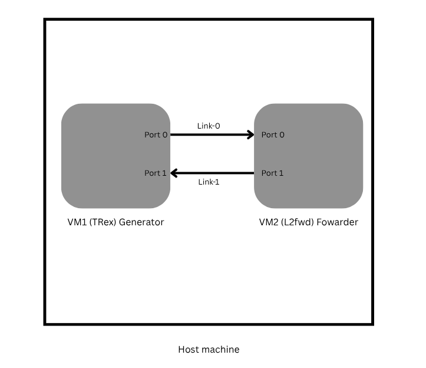

# DPDK NFV Service Chain

**A high-performance Network Function Virtualization (NFV) testbed implementing a transparent L2 forwarding service chain using KVM, DPDK, and Cisco TRex.**

## Overview

This project demonstrates the implementation and benchmarking of a virtualized network service chain. By utilizing **Kernel Bypass networking (DPDK)**, this setup achieves high-throughput packet processing between virtual machines, bypassing the standard Linux kernel network stack.

The project explores three different packet processing architectures:

1.  **Polling Mode (`l2fwd`):** Standard core pinning.
2.  **Event Mode (`l2fwd-event`):** Dynamic load balancing using a Software Scheduler.
3.  **Pipeline Mode (`eventdev_pipeline`):** Granular stage-based processing.

The topology implements a **Unidirectional "Snake" Flow**:

  * **Source:** Traffic is generated on **TRex Port 0**.
  * **Forwarding:** The DUT (VM2) receives packets on Port 0 and forwards them to Port 1.
  * **Destination:** Traffic returns to the Generator on **TRex Port 1**.

## Architecture

The setup utilizes two nested Virtual Machines running on a KVM Hypervisor. The network path is fully isolated from the host OS to ensure accurate benchmarking.



## Technology Stack

  * **Hypervisor:** QEMU/KVM with Libvirt
  * **Packet Processing:** DPDK v25.11
      * *Modules:* `l2fwd` (Customized), `l2fwd-event`, `eventdev_pipeline`
  * **Traffic Generator:** Cisco TRex v3.08
  * **Drivers:** `virtio-pci` with `uio_pci_generic`
  * **Network Mode:** Isolated Virtual Networks

## Documentation

Detailed step-by-step instructions are available in the `docs/` directory:

  * [01. Environment Setup & Prerequisites](docs/01_setup_vm.md)
  * [02. DPDK Installation & Binding](docs/02_dpdk_binding.md)
  * [03. Configuring the Service Chain (Polling Mode)](docs/03_service_chain.md)
  * [04. Running Benchmarks](docs/04_benchmarking.md)
  * [05. Advanced Forwarding: Eventdev & Pipeline](docs/05_eventdev_guide.md)

## Performance Results

*Current benchmark results running on a nested KVM environment:*

| Metric | Result | Notes |
| :--- | :--- | :--- |
| **Throughput (Zero Loss)** | **\~21 Mbps** | Limited by nested virtualization overhead |
| **Packet Loss @ Max Load** | **0%** | Verified via TRex TUI |
| **Topology** | **Unidirectional** | Port 0 -\> Port 1 |

## Quick Start (Summary)

To spin up the service chain, choose your forwarding engine below.

### 1\. Start the Forwarder (VM2)

**Option A: Standard Polling (Best for simplicity)**
*Uses our custom C-code modification to rewrite MAC addresses.*

```bash
sudo ./build/examples/l2fwd/dpdk-l2fwd -l 0-1 -n 4 -- -p 0x3 -T 1
```

**Option B: L2fwd-Event (Automated Scheduling)**
*Uses the Software Eventdev Driver (`event_sw0`) with Core 3 as the Scheduler.*

```bash
sudo ./build/examples/l2fwd-event/dpdk-l2fwd-event \
-l 0-3 -s 0x8 -n 4 --vdev event_sw0 -- \
-p 0x3 --mode=eventdev --eventq-sched=atomic
```

**Option C: Eventdev Pipeline (Manual Roles)**
*Manually assigns Rx(0), Tx(1), Sched(2), and Worker(3).*

```bash
sudo ./build/examples/eventdev_pipeline/dpdk-eventdev_pipeline \
-l 0-3 -n 4 --vdev event_sw0 -- \
-r 0x1 -t 0x2 -e 0x4 -w 0x8 -s 1 -n 0
```

-----

### 2\. Start the Generator (VM1)

**A. Start TRex Server:**

```bash
sudo ./t-rex-64 -i
```

**B. Run Benchmark (Console):**
*Note: If using **Option B or C** (without code mods), you MUST enable Promiscuous Mode first.*

```bash
./trex-console

# 1. Enable Promiscuous Mode (Required for Eventdev Options)
portattr -a --prom on

# 2. Start Traffic (Force Port 0 Source)
start -f stl/bench.py -m 100mbps -p 0
```

## License

This project is open-source and available under the MIT License.